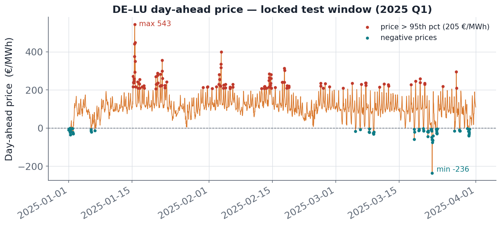
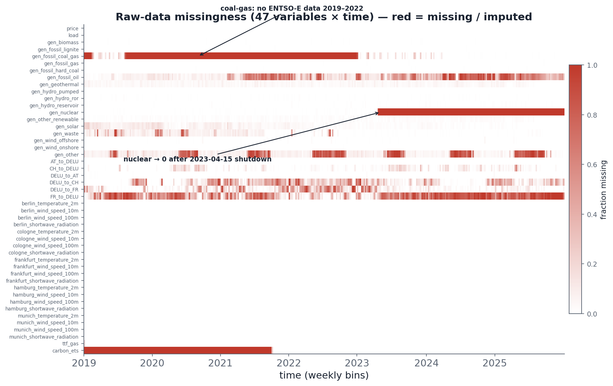

# Energy Market Intelligence System

**Uncertainty-aware forecasting and risk-sensitive control for the German (DE-LU) day-ahead electricity market.**

<p>


</p>

An end-to-end machine-learning system that ingests six years of European power-market data and **propagates calibrated uncertainty through three coupled stages**: forecast electricity demand, forecast price, then dispatch a grid battery under risk constraints. Every forecasting stage emits **q10 / q50 / q90** quantiles that feed the next stage, so downstream models see distributions, not point estimates.

On top of the modular pipeline, the project adds a **multi-task deep-learning model** that forecasts load and price *jointly* from one shared representation, and shows, on a fair head-to-head, that it matches or beats the strong gradient-boosting baseline while decisively beating the recurrent load model.

---

## Headline results (locked 2025-Q1 test set)

The test window (Jan-Mar 2025, 2,160 hours) is touched only for final evaluation. Prices in EUR/MWh, load in MW.

**Price forecasting (h1-6, day-ahead).** A fair, equal-data comparison (both models trained on 2019 to 2024-09, conformal-calibrated on 2024-Q4):

| Model | MAE | pinball | Winkler (interval score) | verdict |
|---|---|---|---|---|
| **Joint multi-task DL** | **22.41** | **7.32** | **107** | wins MAE (sig. at h7-24), pinball + Winkler on every segment |
| CatBoost + conformal | 22.78 | 7.84 | 121 | strong tabular baseline |
| Seasonal naive (168h) | 43.5 | 14.6 | 220 | floor |

**Load forecasting (h1-6).** The joint model beats the dedicated LSTM by roughly a third:

| Model | MAE | Diebold-Mariano vs joint |
|---|---|---|
| **Joint multi-task DL** | **1,586** | reference |
| Multi-scale LSTM | 2,368 | joint better, p < 1e-40 |

**Battery dispatch (RL, EUR per 24h episode, 100 MWh / 50 MW unit).** Risk-aware agents trade against the price forecasts:

| Policy | Mean profit | Sharpe | CVaR 5% |
|---|---|---|---|
| SAC (price-quantile observation) | 13,054 | 1.46 | -2,253 |
| Greedy oracle (perfect within day) | 11,474 | 1.84 | -601 |
| PPO | 5,166 | 1.54 | -1,400 |

A downstream finding worth stating plainly: **the forecaster's strengths propagate into control.** Sharper point forecasts buy more arbitrage profit; sharper *intervals* buy lower tail risk (better CVaR).

---

## Architecture

Uncertainty flows left to right. Each forecasting block emits calibrated quantiles consumed by the next.

```
  data/raw  ─►  preprocessing  ─►  Module A (Load)      ─►  Module B (Price)        ─►  Module C (Control)
  ENTSO-E       Glocal-IB           Multi-scale LSTM         CatBoost per-quantile       PPO / SAC + CVaR
  Open-Meteo    imputation          + conformal              + conformal (CQR)           battery dispatch
  yfinance      + splits            → q10/q50/q90 load       → q10/q50/q90 price         → buy / hold / sell
                                          │                        ▲
                                          └─ load quantiles ───────┘  (A → B feature path)

                       ┌──────────────────────────────────────────────────────────┐
   past 168h  ─────────►  module_joint : one shared TiDE encoder                    │
   known-future          │  ├── load head   → q10/q50/q90 × h1-24                   │
   covariates (calendar, │  └── price head  → q10/q50/q90 × h1-24                   │
   weather, A load q's)  │  non-crossing quantiles · asinh price · seed ensemble    │
                       └──────────────────────────────────────────────────────────┘
```

- **Single source of truth for data.** Every model loads via `src.data.loaders.load_split("train"|"val"|"test")`. Schemas, fixed split bounds, and leakage-safe cross-validation iterators (a 24-hour gap blocks lag-24 leakage) live in `src/data/`.
- **Fixed splits.** Train 2019-2023 (43,824 h), validation 2024 (8,784 h), locked test Jan-Mar 2025 (2,160 h).
- **Calibration everywhere.** Conformalized Quantile Regression (Barber finite-sample quantile) turns raw quantiles into intervals with a coverage guarantee, applied to endpoints only so the median point forecast is never disturbed.

---

## The four model components

### Module A : Load forecasting (`src/module_a/`)
A two-branch multi-scale LSTM (48h + 168h windows) producing 24-hour-ahead load quantiles, conformal-calibrated, exported for downstream use.

### Module B : Price forecasting (`src/module_b/`)
Per-quantile CatBoost regressors (depth and regularization tuned independently per quantile) plus CQR. A very strong tabular baseline: locked-test MAE **23.29 EUR/MWh** at h1-6, coverage ~0.82. Rich causal feature set: price lags, rolling statistics, clean spark/dark spread anchors, residual load, renewable penetration, spike and regime flags, calendar, weather.

### Module Joint : Multi-task deep forecaster (`src/module_joint/`)
The deep-learning centerpiece. One shared **TiDE-style dense encoder** reads a 168-hour lookback and feeds two task heads (load and price), each emitting **non-crossing** q10/q50/q90 across h1-24 via a monotone cumulative-softplus parameterization. Prices are `asinh`-transformed (handles negative day-ahead prices), the encoder is given the same engineered fundamentals as the boosting baseline (feature parity), predictions are **seed-ensembled**, then conformally calibrated.

The final design was reached by disciplined, validation-only iteration, spending the locked test sparingly. The short version of what moved the needle: feature parity closed most of the gap to CatBoost, removing interfering auxiliary heads fixed the long horizons, and ensembling sealed it.

### Module C : Risk-sensitive battery dispatch (`src/module_c/`)
A Gymnasium environment for a 100 MWh / 50 MW battery doing day-ahead arbitrage. The observation includes the upstream price quantiles; the reward is profit penalized by a rolling **CVaR** (expected shortfall) term. Agents: PPO and SAC (stable-baselines3), benchmarked against idle and greedy-oracle baselines.

---

## The data

Six raw sources spanning 2019-2025, hourly:

| Source | Content |
|---|---|
| ENTSO-E | Day-ahead prices, actual load, generation by source (17 types), cross-border flows |
| Open-Meteo | Weather for 5 German cities (temperature, wind at 10m/100m, shortwave radiation) |
| yfinance | TTF gas and EU carbon (ETS) prices |

Missing values are imputed with an improved **Glocal-IB / SAITS** variant (a vendored, physics-constrained fork in `GlocalIB/`), with structural-zero handling for genuinely-absent series. Two illustrative views of the raw problem:

<p>


</p>

---

## Quickstart

```bash
# 1. environment
pip install -r requirements.txt          # or requirements.lock.txt for exact pins
export PYTORCH_ENABLE_MPS_FALLBACK=1      # Apple Silicon

# 2. end-to-end pipeline (data already provided under data/splits/)
make all                                  # splits -> Module A -> B -> C
make help                                 # list every target

# 3. run a single stage
make module_b                             # price forecasting
make module_c                             # RL battery dispatch

# 4. the multi-task deep model
PYTHONPATH=src python -m module_joint.train --backbone tide --epochs 120 --seed 42
```

Reproducible experiment scripts live in `scripts/` (backbone benchmark, ablations, the fair updated-data comparison, and the B->C control study). All training is seeded; device selection is CUDA -> MPS -> CPU with an `EMIS_FORCE_CPU=1` escape hatch.

---

## Repository layout

```
src/
  data/          shared loaders, schemas, leakage-safe CV iterators
  ingestion/     ENTSO-E / Open-Meteo / yfinance collectors (resumable)
  preprocessing/ Glocal-IB imputation, physical constraints, split builder
  module_a/      multi-scale LSTM load forecaster (+ CQR)
  module_b/      CatBoost per-quantile price forecaster (+ CQR)
  module_joint/  shared-encoder multi-task load + price deep model
  module_c/      Gymnasium battery env + PPO/SAC + CVaR reward
GlocalIB/        vendored physics-constrained imputation fork
scripts/         pipeline orchestrator + experiment drivers
notebooks/       per-module exploration and evaluation
tests/           unit + property tests (pytest)
data/            raw, imputed, and the fixed train/val/test splits
checkpoints/     trained models
```

---

## Tech stack

PyTorch 2.12 (MPS-ready) · CatBoost · stable-baselines3 + Gymnasium · scikit-learn · pandas · numpy · pypots (imputation). Python 3.13.

## Testing and reproducibility

```bash
PYTHONPATH=src pytest tests/                          # full suite
PYTHONPATH=src pytest tests/module_joint/ -m slow     # end-to-end smoke on real data
```

Splits are fixed and the locked test window is isolated to final-evaluation code paths, so reported numbers are honest out-of-sample estimates. Every model exposes a uniform `predict_quantiles` contract returning a long-form frame indexed by `(origin, horizon)` with `q10/q50/q90`.

## License

Released under the MIT License. See [LICENSE](LICENSE) and [NOTICE](NOTICE); citation metadata in [CITATION.cff](CITATION.cff).
