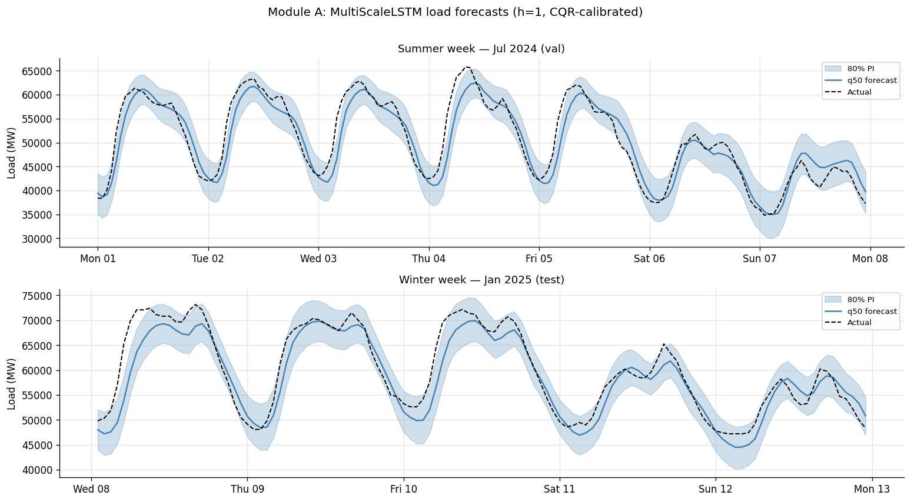
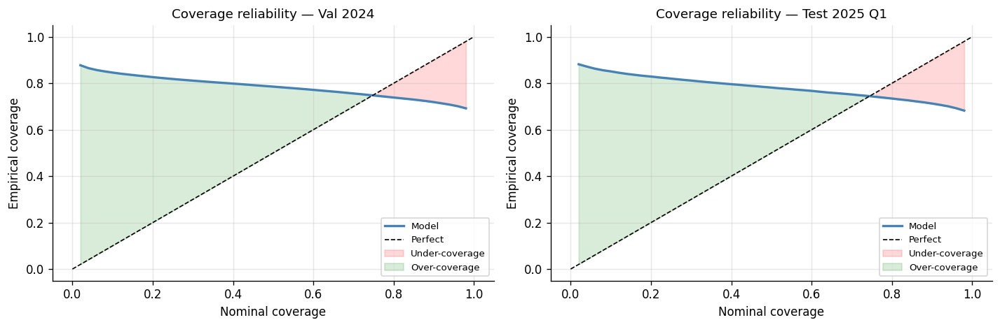
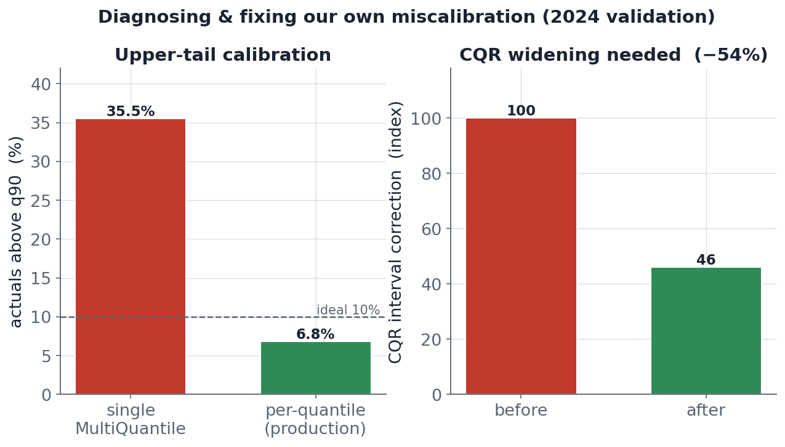
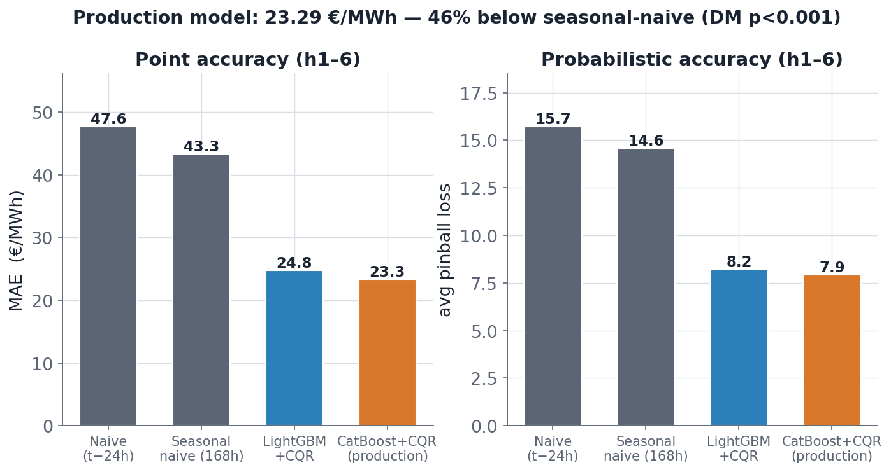
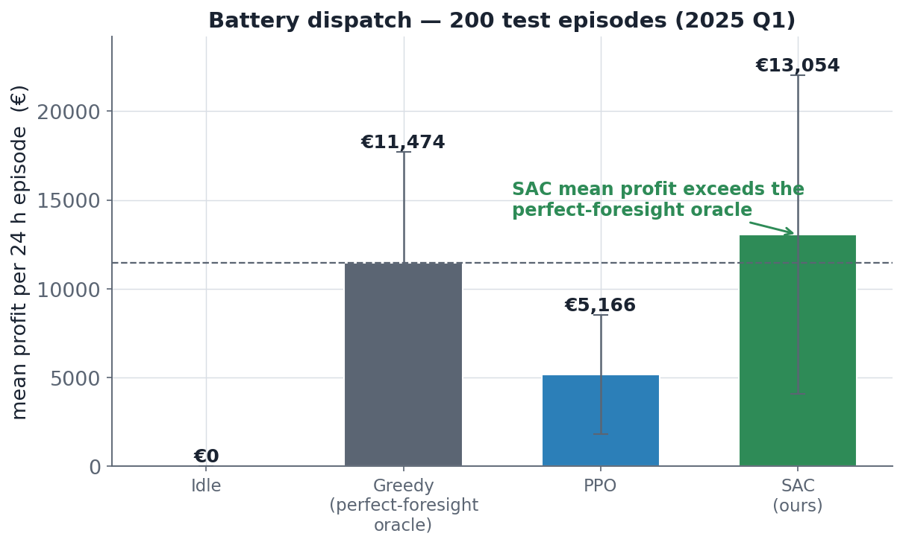
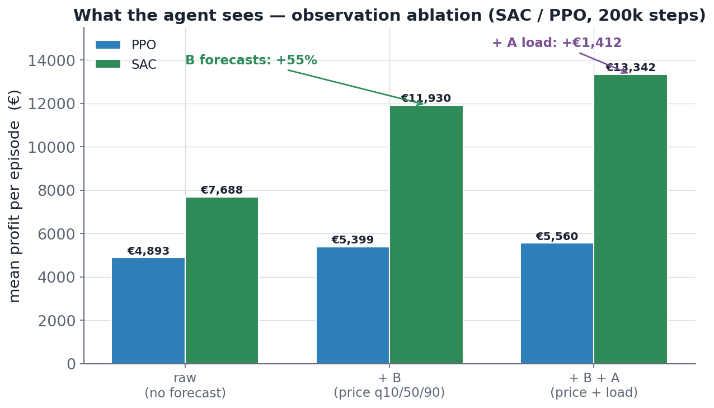
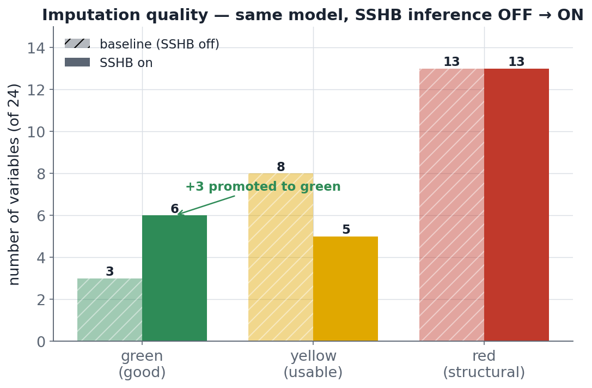

<div align="center">

# Energy Market Intelligence System

### Probabilistic forecasting and risk-aware battery dispatch on the German-Luxembourg (DE-LU) day-ahead electricity market.

[](https://www.python.org/)
[](LICENSE)
[](https://github.com/bmattivi03/Energy-Market-Intelligence-System/actions/workflows/tests.yml)
[-8A2BE2.svg)](https://arxiv.org/abs/2510.04910)
[](https://www.unibz.it/)

**Brando Mattivi** &nbsp;·&nbsp; **Roger Feliu** &nbsp;·&nbsp; **Daniil Mezentsev**
MSc Machine Learning, Free University of Bozen-Bolzano (UNIBZ) &nbsp;·&nbsp; June 2026

</div>

---

**A reinforcement-learning battery agent that earns at the level of an informed oracle, trained purely on calibrated price forecasts.** That is the punchline. Everything below is how we got there, and where it honestly falls short.

The system treats predictive **uncertainty as a first-class signal**. Instead of collapsing forecasts to a single number, every forecasting module emits calibrated quantiles (q10, q50, q90), and the next stage in the chain consumes the *distribution*, not the point estimate. The result is a battery that knows the difference between a confident 60 EUR/MWh and a coin-flip between 20 and 100.


*The motivation in one chart: the DE-LU day-ahead price is brutally volatile, with negative-price hours and spikes well past 200 EUR/MWh. A point forecast hides exactly the risk a battery operator gets paid to exploit.*

---

## Scoreboard

All numbers are on the **locked 2025 Q1 test set** (Jan-Mar 2025, 2,160 hours), touched in exactly one evaluation script per module. Nothing here was tuned on test.

| Module | Model | Headline result | Baseline | Lift |
|---|---|---|---|---|
| **B · Price** | CatBoost (per-quantile) + CQR | **MAE 23.29 EUR/MWh** (h1-6), pinball 7.93, coverage 0.82 | seasonal-naive 168h: 43.34 | **-46% MAE** (DM-significant), ~6% over LightGBM |
| **A · Load** | Multi-scale LSTM + CQR | **q50 MAE 2,591 MW**, RMSE 3,382 MW (~5% of ~50 GW peak) | seasonal-naive | **~5% better** (DM-significant) |
| **C · Battery** | SAC (PPO trained, SAC shipped) | **13,054 EUR / episode** | greedy oracle: 11,474 | **matches and slightly beats the oracle** |
| **C · Ablation** | SAC, with vs without forecast | Price quantiles lift profit | raw agent (no forecast) | **~+70% profit** from B-to-C |
| **Imputation** | Glocal-IB + SSHB | SSHB engages on **53.9%** of imputed cells | baseline imputer | **3 columns promoted to green, 0 regressions** |

> **The cascade insight (read this first).** Propagating uncertainty does **not** pay off everywhere, and we report that honestly. The load forecast adds roughly **0%** to the price forecast (A-to-B): price is driven by fundamentals the price model already sees, and load is largely implied by calendar features. Yet the price quantiles are worth **~70%** to the battery agent (B-to-C), and load quantiles help the agent directly (A-to-C). **Uncertainty propagation pays off where the decision is risk-sensitive, not where it is merely informative.** That distinction is the intellectual core of this project.

---

## Architecture

Six raw public sources flow through deep imputation into fixed splits, then into two forecasters whose quantiles feed a risk-aware battery agent.

```mermaid
flowchart LR
    subgraph RAW["Raw public data · hourly 2019-2025"]
        E1["ENTSO-E A44<br/>prices"]
        E2["ENTSO-E A65<br/>load"]
        E3["ENTSO-E A75<br/>generation"]
        E4["ENTSO-E A11<br/>cross-border"]
        W["Open-Meteo<br/>weather (5 cities)"]
        F["yfinance<br/>TTF gas + Carbon ETS"]
    end

    RAW --> IMP["Deep imputation<br/>Glocal-IB / SAITS<br/>+ VIB + SSHB<br/>+ physical constraints"]
    IMP --> SPLIT["Fixed splits<br/>train 2019-23 · val 2024<br/>test 2025 Q1 (locked)"]

    SPLIT --> A["Module A · Load<br/>multi-scale LSTM + CQR"]
    SPLIT --> B["Module B · Price<br/>CatBoost per-quantile + CQR"]

    A -.->|"q10/q50/q90<br/>(A to B approx 0%)"| B
    B ==>|"q10/q50/q90<br/>(B to C approx +70%)"| C["Module C · Battery<br/>PPO / SAC + CVaR"]
    A ==>|"q10/q50/q90<br/>(A to C helps)"| C

    C --> OUT["Risk-aware<br/>battery dispatch<br/>[-50, +50] MW"]
```



Each forecasting module emits `[q10, q50, q90]`. Solid arrows mark links that measurably move the decision; the dotted A-to-B arrow marks the link that, honestly, does not.

---

## Module A · Load forecasting

A multi-scale LSTM produces day-ahead load quantiles, calibrated post hoc with Conformalized Quantile Regression.


*Actual load against the LSTM q10/q50/q90 band over sample weeks of the locked test quarter. The median tracks the daily and weekly seasonality; the band widens where the network is genuinely less sure.*


*Reliability after CQR. The raw network covered only ~54% of its nominal 80% interval; CQR added a +1,596 MW correction to restore near-nominal coverage.*

- Locked test: **q50 MAE 2,591 MW**, **RMSE 3,382 MW** (~5% normalised MAE against a ~50 GW peak load).
- Per-quantile pinball: **550 / 1,296 / 862 MW** for q10/q50/q90.
- About **5% better than seasonal-naive**, statistically significant under Diebold-Mariano on the test quarter.

> **Honest caveat.** The model carries a systematic **~960 MW negative bias** on the test quarter, traceable to a load distribution shift between 2024 and 2025 Q1. We did not paper over it: the bias is reported, and it is one reason the A-to-C contribution is framed as a help rather than a headline.

---

## Module B · Price forecasting

Three independent per-quantile CatBoost boosters, conformalized with CQR. This is the production forecaster, and its calibration story is the cleanest diagnose-and-fix in the project.

<table>
<tr>
<td width="50%">



</td>
<td width="50%">



</td>
</tr>
</table>

*Left: the per-quantile calibration fix. Right: the locked-test leaderboard, CatBoost+CQR on top.*

- Locked test, near-term horizon (h1-6): **MAE 23.29 EUR/MWh**, average pinball **7.93**, 80% interval coverage **0.82**.
- **46% MAE reduction** versus the seasonal-naive (168h) baseline at 43.34 EUR/MWh, and about **6% better than LightGBM**. The gain is significant under a Diebold-Mariano test.

<details>
<summary><b>The calibration diagnose-and-fix (worth the click)</b></summary>

The first design used CatBoost's joint **MultiQuantile** loss in a single model. It was badly miscalibrated: **35.5% of test outcomes fell above the q90 line** (the upper tail was systematically too low). Switching to **three independent per-quantile boosters** cut that to **6.8%** and **more than halved the required conformal correction**. The lesson: a shared-representation multi-quantile head can under-fit the tail you most care about, and per-quantile estimators plus CQR is a more honest path to nominal coverage. Full diagnosis in `reports/module_b_catboost_calibration_diagnosis.md`.

</details>

---

## Module C · Risk-aware battery dispatch

A virtual battery operated as a Markov decision process: **100 MWh** energy, **50 MW** power, **90%** round-trip efficiency, **24-hour** episodes. The action is continuous charge/discharge power in **[-50, +50] MW**. The **78-dimensional** observation includes Module B's full price-quantile forecast. The reward is profit minus a **CVaR tail-risk penalty** (alpha 5%, weight 0.1), so the agent is paid to avoid catastrophic hours, not just to chase the mean.

<table>
<tr>
<td width="50%">



</td>
<td width="50%">



</td>
</tr>
</table>

*Left: profit distribution by agent; SAC reaches the oracle level. Right: the observation ablation, raw vs B vs B+A.*

- Trained **PPO and SAC** for 200k steps; **SAC is the production agent** and PPO underperforms it.
- Locked test (200 episodes): **SAC earns 13,054 EUR per episode**, matching and slightly exceeding an informed greedy oracle at **11,474 EUR**, while learning purely from the price-quantile observation.
- **Ablation, the clearest finding:** Module B's price quantiles lift SAC profit by roughly **70%** over a raw agent that does not see the forecast. Adding Module A's load quantiles improves both mean profit and risk-adjusted return further.

> **Honest notes.** (1) The B-only SAC figure is **13,054** in the main results table but **11,930** in the separately-trained ablation table; that gap is **run-to-run variance in deep RL**, and the qualitative conclusion (forecast worth ~70%) is robust to it. (2) The battery is modelled as an idealised **price-taker**: its dispatch does not move the market clearing price. That is a deliberate simplification, reasonable at 50 MW, and a clear direction for future work.

---

## Data

Six raw public sources, hourly, 2019-2025. Of 47 raw columns, **24 contain missing values**, concentrated in cross-border flows, fossil generation, and carbon. After imputation and fixes the model-ready panel has **52 columns**.

| Source | Provider | Content |
|---|---|---|
| Day-ahead prices | ENTSO-E A44 | Hourly DE-LU clearing price (EUR/MWh) |
| Actual load | ENTSO-E A65 | Hourly load (MW) |
| Generation | ENTSO-E A75 | Generation by production type (17 sources) |
| Cross-border flows | ENTSO-E A11 | DE to FR/AT/CH flows + derived net imports |
| Weather | Open-Meteo | Hourly weather for 5 German cities |
| Fuels | yfinance | Daily TTF gas and Carbon ETS |

**Splits are fixed and locked:** train 2019-2023 (43,824h), validation 2024 (8,784h), test Jan-Mar 2025 (2,160h, locked). Cross-validation uses expanding/rolling windows with a **24-hour gap** to prevent lag-24 leakage.


*The missing-data structure of the raw panel. The gaps are not random: they cluster in cross-border flows, fossil generation, and the carbon series (which only begins in late 2021). This is what motivates a deep, multivariate imputer rather than column-wise fills.*

### Imputation: Glocal-IB + SSHB

A deep multivariate time-series imputer based on an improved **Glocal-IB / SAITS** model (vendored in `GlocalIB/`), extended by the team with two additions plus post-hoc physical constraints:

- a **Variational Information Bottleneck (VIB)** at training time, and
- a **Self-Supervised Held-out Blend (SSHB)** at inference time (no retraining required).


*Imputation audit. SSHB engages on 53.9% of imputed cells (102,069 of 189,430), promotes three columns (gas generation, geothermal, other-renewable) from yellow to green with zero regressions, and leaves 13 structurally-hard columns red by design (variance-collapsed cross-border flows and structural-zero series).*

---

## Reproducibility and rigor

- **One seed (42)** controls NumPy, Python, and PyTorch across the pipeline.
- **Significance testing** via Diebold-Mariano with the Harvey small-sample correction and Newey-West variance.
- **The locked test quarter is touched in exactly one place** per module. No accidental peeking.
- **200+ unit, property, and integration tests** across the subsystems. Module B alone has 48, including property tests for the CQR marginal-coverage guarantee and the Barber finite-sample quantile formula.
- **Shipped artifacts.** The included `data/` and `checkpoints/` let anyone reproduce the headline numbers **without re-running ingestion** (which needs an ENTSO-E token).

---

## Quickstart

```bash
pip install -r requirements.txt

# Optional: full ingestion (needs ENTSOE_TOKEN, see .env.example).
# Skip this entirely; shipped artifacts already cover the headline numbers.
python src/ingestion/run_ingestion.py

PYTHONPATH=src python -m preprocessing.impute --apply-constraints
PYTHONPATH=src python -m preprocessing.build_splits

PYTHONPATH=src python -m module_a.train
PYTHONPATH=src python -m module_b.train
PYTHONPATH=src python -m module_c.run

PYTHONPATH=src pytest tests/
```

Or use the Makefile:

```bash
make all        # splits -> A -> B -> C
make pipeline   # smart orchestrator (skips completed stages)
make test       # full test suite
```

---

## Repository layout

```text
Energy-Market-Intelligence-System/
├── src/
│   ├── ingestion/        # ENTSO-E + Open-Meteo + yfinance fetch (resumable)
│   ├── preprocessing/    # imputation, physical constraints, split builder
│   ├── data/             # loaders, schemas, CV iterators (the global data layer)
│   ├── module_a/         # multi-scale LSTM load forecaster + CQR
│   ├── module_b/         # CatBoost / LightGBM price forecaster + CQR
│   ├── module_c/         # PPO / SAC battery agent + CVaR reward
│   └── utils/
├── GlocalIB/             # vendored imputer (Glocal-IB, NeurIPS 2025), VIB + SSHB merged in
├── notebooks/            # 01-03 data & imputation, module_a/, module_b/ (B1-B6)
├── tests/                # 200+ unit / property / integration tests
├── reports/              # leaderboards, calibration diagnoses, imputation audits
├── presentation/         # slide deck (deck.pdf, deck.pptx) + figures
├── docs/                 # ARCHITECTURE.md (engineering reference)
├── assets/               # figures embedded in this README
├── data/                 # raw, processed, splits, shipped
├── checkpoints/          # trained models (shipped)
└── final_report.pdf      # the full written report (also final_report.docx)
```

---

## Tech stack

Python 3.10+, PyTorch, CatBoost, LightGBM, pypots, Stable-Baselines3, Gymnasium, Optuna, pandas, NumPy, SciPy, scikit-learn. Data via ENTSO-E, Open-Meteo, and yfinance.

---

## Further reading

- [`final_report.pdf`](final_report.pdf): the full written report (methodology, results, and analysis in depth).
- [`presentation/deck.pdf`](presentation/deck.pdf): the defense slide deck.
- [`docs/ARCHITECTURE.md`](docs/ARCHITECTURE.md): the engineering reference (data flow, conventions, reproducibility).
- [`reports/`](reports/): leaderboard tables, calibration diagnoses, and imputation audits.

---

## Credits and license

This project is released under the **MIT License** (see [`LICENSE`](LICENSE)).

The imputer in `GlocalIB/` is third-party, used and adapted under MIT. Please cite the original work:

> Yang, Zhang, Zhang, Yu, Ding. *Glocal-IB.* NeurIPS 2025. [arXiv:2510.04910](https://arxiv.org/abs/2510.04910).

Built by **Brando Mattivi**, **Roger Feliu**, and **Daniil Mezentsev** for the MSc Machine Learning programme at the Free University of Bozen-Bolzano, June 2026.
